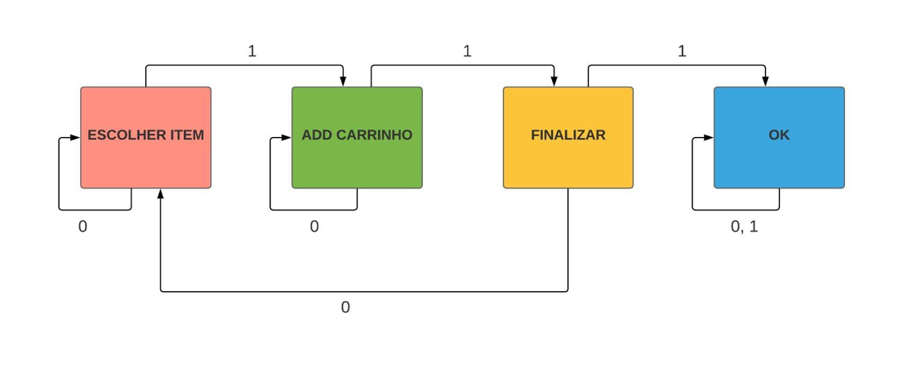
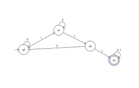
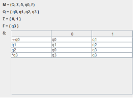

# Autômato Finito Determinístico

### Objetivo

Simular um mini e-commerce. Onde, recebida uma devida entrada, transita pelos possíveis estados estipulados.

### Alfabeto do Autômato

-   **0**, **1**

### Estados

1. _Escolher Item_
2. _Add Carrinho_
3. _Finalizar_
4. _Ok_

### Diagrama de Estados

### Representação Formal do Diagrama de Estados 

### Função programa como tabela (Q, ∑, δ, q0, F)

### Função programa (δc =  Q X ∑ → Q)

1. **δc(q0, 1) = q1**
2. **δc(q0, 0) = q0**
3. **δc(q1, 1) = q2**
4. **δc(q1, 0) = q1**
5. **δc(q2, 1) = q3**
6. **δc(q2, 0) = q0**
7. **δc(q3, 1) = q3**
8. **δc(q3, 0) = q3**

## Contribuidores

### Referências Utilizadas

* [O que é um autômato?] - Fundamentação de lógica.
* [Autômatos Finitos UFSCar] - Conceitos para elaboração do código.
* [Simulador de Autômatos JAVA] - Realização do diagrama principal e tabelas.

[O que é um autômato?]: <https://pt.wikipedia.org/wiki/Aut%C3%B4mato_finito_determin%C3%ADstico>
[Autômatos Finitos UFSCar]: <https://www.youtube.com/watch?v=xlrVXXt1dlI&t=36s>
[Simulador de Autômatos JAVA]: <https://www.youtube.com/watch?v=f6WZWRA2bx8>
